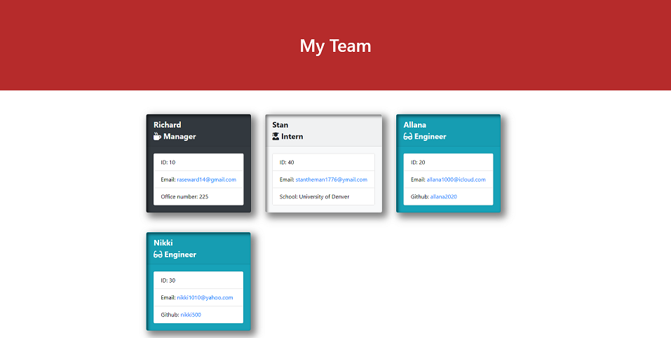

email validator https://www.youtube.com/watch?v=V-qHDWxUT18

# Team_Profile_Generator

## Description
Node.js command-line application that takes information about employees on a software engineering team, then generates an HTML webpage that displays summaries for each person. Click the link below for a video walkthrough.

**[Check out the video here!]()**

Test driven development is utilized. A passing unit test is included for every part of the code. This application utilizes nmp's jest and inquirer packages. Invoke the application by running the command node index.js in the command line.

## Table of Contents
* [Usage](#usage)
* [Credits](#credits)
* [License](#license)

## Usage
* **The Finished Product**  

## Credits
Here are a few resources that helped me get this project knocked out!
* [Peachpit border-box](https://www.peachpit.com/articles/article.aspx?p=1925240&seqNum=3#:~:text=The%20basic%20box-shadow%20syntax%20is%20as%20follows%3A%20box-shadow%3A,negative%20values%20offset%20the%20shadow%20left%20and%20up)
* [w3schools link to email](https://www.w3schools.com/html/html_links.asp)
* [email validator](https://www.youtube.com/watch?v=V-qHDWxUT18)

## License
* Link for more information: (https://opensource.org/licenses/MIT)
* MIT License

      Copyright (c) [year] [fullname]
      
      Permission is hereby granted, free of charge, to any person obtaining a copy
      of this software and associated documentation files (the "Software"), to deal
      in the Software without restriction, including without limitation the rights
      to use, copy, modify, merge, publish, distribute, sublicense, and/or sell
      copies of the Software, and to permit persons to whom the Software is
      furnished to do so, subject to the following conditions:
      
      The above copyright notice and this permission notice shall be included in all
      copies or substantial portions of the Software.
      
      THE SOFTWARE IS PROVIDED "AS IS", WITHOUT WARRANTY OF ANY KIND, EXPRESS OR
      IMPLIED, INCLUDING BUT NOT LIMITED TO THE WARRANTIES OF MERCHANTABILITY,
      FITNESS FOR A PARTICULAR PURPOSE AND NONINFRINGEMENT. IN NO EVENT SHALL THE
      AUTHORS OR COPYRIGHT HOLDERS BE LIABLE FOR ANY CLAIM, DAMAGES OR OTHER
      LIABILITY, WHETHER IN AN ACTION OF CONTRACT, TORT OR OTHERWISE, ARISING FROM,
      OUT OF OR IN CONNECTION WITH THE SOFTWARE OR THE USE OR OTHER DEALINGS IN THE
      SOFTWARE.
